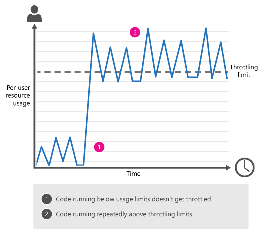
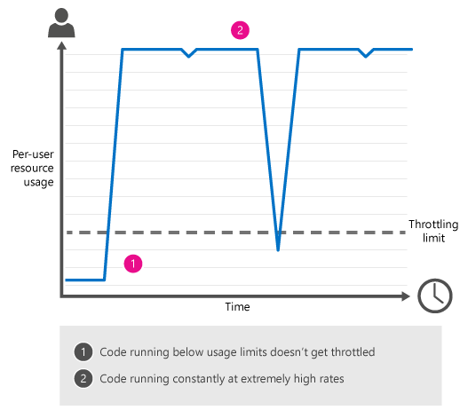

# How to: Avoid getting throttled or blocked in SharePoint Online
Find out about throttling in SharePoint Online, and learn how to avoid being throttled or blocked. Includes sample CSOM and REST code you can use to make your task easier. 
 *In this article:* 
  
    
    


-  [What is throttling?](how-to-avoid-getting-throttled-or-blocked-in-sharepoint-online.md#BKMK_Whatisthrottling)
    
  
-  [Common throttling scenarios in SharePoint Online](how-to-avoid-getting-throttled-or-blocked-in-sharepoint-online.md#BKMK_Commonthrottlingscenarios)
    
  
-  [Why can't you just tell me the exact throttling limits?](how-to-avoid-getting-throttled-or-blocked-in-sharepoint-online.md#BKMK_Whycantyoujusttellmetheexactthrottlinglimits)
    
  
-  [Best practices to handle throttling](how-to-avoid-getting-throttled-or-blocked-in-sharepoint-online.md#BKMK_Bestpracticestohandlethrottling)
    
  
-  [GitHub CSOM code samples: SharePoint Online Throttling](how-to-avoid-getting-throttled-or-blocked-in-sharepoint-online.md#BKMK_GitHubCSOMandRESTcodesamplesSharePointOnlineThrottling)
    
  
-  [What should you do if you get blocked in SharePoint Online?](how-to-avoid-getting-throttled-or-blocked-in-sharepoint-online.md#BKMK_Whatshouldyoudoifyougetblocked)
    
  
-  [Additional resources](how-to-avoid-getting-throttled-or-blocked-in-sharepoint-online.md#BKMK_Additionalresources)
    
  

Does this sound familiar? You're running a CSOM process - for example, to migrate files in SharePoint Online - but you keep getting throttled. Or even worse, you get completely blocked. What's going on and what can you do to make it stop? 
  
    
    


## What is throttling?
<a name="BKMK_Whatisthrottling"> </a>

SharePoint Online uses throttling to maintain optimal performance and reliability of the SharePoint Online service. Throttling limits the number of user actions or concurrent calls (by script or code) to prevent overuse of resources. 
  
    
    
That said, it is extremely rare for a user to get throttled in SharePoint Online. The service is robust, and it is designed to handle very high volume. If you do get throttled, 99% of the time it is because of custom code. That doesn't mean that there aren't other ways to get throttled, just that they are less common. For example you spin up 10 machines and have a sync client going on all 10. On each sync 1TB of content. This would likely get you throttled. 
  
    
    

  
    
    

  
    
    

### What happens when you get throttled in SharePoint Online?

When a user exceeds usage limits, SharePoint Online throttles any further requests from that user account for a short period. All user actions are throttled while the throttle is in effect. 
  
    
    

- For requests that a user performs directly in the browser, SharePoint Online redirects you to the throttling information page, and the requests fail. 
    
  
- For all other requests, including CSOM or REST calls, SharePoint Online returns HTTP status code 429 ("Too many requests"), and the requests fail. 
    
  
If the offending process continues to exceed usage limits, SharePoint Online might completely block the process; in this case, you may see HTTP status code 503 ("Service unavailable"), and we'll notify you of the block in the Office 365 Message Center. The error message is shown below: 
  
    
    

  
    
    

  
    
    
503 Server unavailable message. 
  
    
    

## Common throttling scenarios in SharePoint Online
<a name="BKMK_Commonthrottlingscenarios"> </a>

The most common causes of per-user throttling in SharePoint Online are client-side object model (CSOM) or Representational State Transfer (REST) code that performs too many actions too frequently. 
  
    
    

- **Sporadic traffic**
    
    Not a lot of traffic at any one time, but enough over time that you run in and out of throttling in an episodic way. 
    
  - For example, after migrating files to SharePoint Online, you run a custom CSOM or REST script to update metadata on the files. The CSOM/REST script is updating a large number of files at a very high frequency, which triggers throttling. Similarly, an autocomplete UI widget using REST services, making too many calls to lists during each end user operation, may also cause throttling, depending on what other operations are consuming resources at the same time. 
    
     
  

  

  
- **Overwhelming traffic**
    
    A single process dramatically exceeds throttling limits, continually, over a long time period. 
    
  - You used web services to build a tool to synchronize user profile properties. The tool updates user profile properties based on information from your line-of-business (LOB) human resources (HR) system. The tool makes calls at too high a frequency. 
    
  
  - You're running a load-testing script on SharePoint Online and you get throttled. Load testing is not allowed on SharePoint Online. 
    
  
  - You customized your team site on SharePoint Online, for example, by adding a status indicator on the Home page. This status indicator updates frequently, which causes the page to make too many calls to the SharePoint Online service - this triggered throttling. 
    
     
  

  

  

## Why can't you just tell me the exact throttling limits?
<a name="BKMK_Whycantyoujusttellmetheexactthrottlinglimits"> </a>

Setting and publishing exact throttling limits sounds very straightforward, but in fact, it's not the best way to go. We continually monitor resource usage on SharePoint Online. Depending on usage, we fine-tune thresholds so users can consume the maximum number of resources without degrading the reliability and performance of SharePoint Online. That's why it's so important for your CSOM or REST code to include incremental back off to handle throttling; this lets your code run as fast as possible on any given day, and it lets your code back off "just enough" if it hits throttling limits. The code samples later in this article show you how to use incremental back off. 
  
    
    

## Best practices to handle throttling
<a name="BKMK_Bestpracticestohandlethrottling"> </a>


- Reduce the number of operations per request 
    
  
- Reduce the frequency of calls 
    
  
- Use incremental back off to reduce the number and frequency of calls until no more throttling occurs 
    
  
Incremental back off uses progressively longer waits between retries before trying again to run the code that was throttled. You can use the GitHub code samples, later in this article, written as extension methods, to add incremental back off to your code. 
  
    
    
Backing off is the fastest way to handle being throttled because SharePoint Online continues to log resource usage while a user is being throttled. In other words, aggressive retries work against you because even though the calls fail, they still accrue against your usage limits. The faster you back off, the faster you'll stop exceeding usage limits. 
  
    
    
For information about ways to monitor your SharePoint Online activity, see  [Diagnosing performance issues with SharePoint Online](http://msdn.microsoft.com/library/93502df4-552f-409b-971b-2e9b0f38588f.aspx). 
  
    
    
For a broader discussion of throttling on the Microsoft Cloud, see  [Throttling Pattern](http://msdn.microsoft.com/library/4baf5af2-32fc-47ab-8569-3e5c59a5ebd5.aspx). 
  
    
    

## GitHub CSOM code samples: SharePoint Online Throttling
<a name="BKMK_GitHubCSOMandRESTcodesamplesSharePointOnlineThrottling"> </a>

 [CoreThrottling](https://github.com/OfficeDev/PnP/tree/dev/Samples/Core.Throttling) in the [Office 365 Developer Patterns and Practices repository ](http://github.com/OfficeDev/PnP) is a code sample that demonstrates the incremental back off technique. The technique requires minimal changes to your code.
  
    
    
Before you run this code sample: 
  
    
    

- Open **Program.cs** and enter the following information in the **Main** method:
    
  - Your Office 365 Developer account credentials. 
    
  
  - The URL of your Office 365 Developer Site. 
    
  
  - The name of a test document library on your Office 365 Developer Site. 
    
  
- If you receive an error stating that the **App.Config** file is invalid, go to **Solution Explorer**, right click **App.config**, and choose **Exclude From Project**.
    
  
 **Core.Throttling** runs as a console application using a user-only authorization policy, which means this code sample uses the permissions of the current user. In the **Main** method in Program.cs, a while loop repeatedly creates new folders in the test document library. A call is then made to **ctx.ExecuteQueryWithExponentialRetry**, which uses CSOM to perform the **ExecuteQuery** method. **ExecuteQueryWithExponentialRetry** is an extension method on the [ClientContext](https://msdn.microsoft.com/library/office/microsoft.sharepoint.client.clientcontext%28v=office.15%29.aspx) object, and is defined in **ClientContextExtension.cs**.
  
    
    
If SharePoint Online throttles the **ExecuteQuery** statement, **ExecuteQueryWithIncrementalRetry** starts the incremental back off technique by:
  
    
    

- Catching a **WebException** and checking the **HttpWebResponse.StatusCode**. If SharePoint Online throttled the **ExecuteQuery** statement, the **HttpWebResponse.StatusCode** is 429.
    
  
- The current thread is suspended for the period specified in **backoffInterval**.
    
  
- When the current thread resumes, the **backoffInterval** is doubled and the number of retries performed ( **retryAttempts** ) is incremented. By doubling **backoffInterval** your code suspends activity for a longer period of time before retrying the code that was throttled by SharePoint Online.
    
  
- The process is repeated until either the **ExecuteQuery** statement is successful, or the number of allowed retries ( **retryCount** ) is exceeded.
    
  

### CSOM Code sample: Incremental back off and retry (calls ExecuteQueryWithIncrementalRetry method, later in this article)


```

using (var ctx = new ClientContext(serverUrl))
       {
           //Provide account and pwd for connecting to the source
           var passWord = new SecureString();
           foreach (char c in password.ToCharArray()) passWord.AppendChar(c);
           ctx.Credentials = new SharePointOnlineCredentials(login, passWord);
            try
           {
               int number = 0;
               // This loop will be executed 1000 times, which will cause throttling to occur
               while (number < 1000)
               {
                   // Try to create new folder based on Ticks to the given list as an example process
                   var folder = ctx.Site.RootWeb.GetFolderByServerRelativeUrl(listUrlName);
                   ctx.Load(folder);
                   folder = folder.Folders.Add(DateTime.Now.Ticks.ToString());
                   // Extension method for executing query with throttling checks
                   ctx.ExecuteQueryWithIncrementalRetry(5, 30000); //5 retries, with a base delay of 30 secs.
                   // Status indication for execution.
                   Console.WriteLine("CSOM request successful.");
                   // For loop handling.
                   number = number + 1;
               }
           }
           catch (MaximumRetryAttemptedException mex)
           {
               // Exception handling for the Maximum Retry Attempted
               Console.WriteLine(mex.Message);
           }
       }

```


### CSOM Code sample: ExecuteQueryWithIncrementalRetry method


```

public static void ExecuteQueryWithIncrementalRetry(this ClientContext context, int retryCount, int delay)
        {
            int retryAttempts = 0;
            int backoffInterval = delay;
            if (retryCount <= 0)
                throw new ArgumentException("Provide a retry count greater than zero.");
           if (delay <= 0)
                throw new ArgumentException("Provide a delay greater than zero.");
           while (retryAttempts < retryCount)
            {
                try
                {
                    context.ExecuteQuery();
                    return;
                }
                catch (WebException wex)
                {
                    var response = wex.Response as HttpWebResponse;
                    if (response != null &amp;&amp; response.StatusCode == (HttpStatusCode)429)
                    {
                        Console.WriteLine(string.Format("CSOM request exceeded usage limits. Sleeping for {0} seconds before retrying.", backoffInterval));
                        //Add delay.
                        System.Threading.Thread.Sleep(backoffInterval);
                        //Add to retry count and increase delay.
                        retryAttempts++;
                        backoffInterval = backoffInterval * 2;
                    }
                    else
                    {
                        throw;
                    }
                }
            }
            throw new MaximumRetryAttemptedException(string.Format("Maximum retry attempts {0}, have been attempted.", retryCount));
       }

```


## What should you do if you get blocked in SharePoint Online?
<a name="BKMK_Whatshouldyoudoifyougetblocked"> </a>

Blocking is the most extreme form of throttling. We rarely ever block a tenant, unless we detect long-term, extremely excessive traffic that may threaten the overall health of the SharePoint Online service. We apply blocks to prevent excessive traffic from degrading the performance and reliability of SharePoint Online. A block - which is usually placed at the tenancy level - prevents the offending process from running until you fix the problem. If we block your subscription, you must take action to modify the offending processes before the block can be removed. 
  
    
    
If we block your subscription, you'll see HTTP status code 503, and we'll notify you of the block in the Office 365 Message Center. The message describes what caused the block, provides guidance on how to resolve the offending issue, and tells you who to contact to get the block removed. 
  
    
    

## Additional resources
<a name="BKMK_Additionalresources"> </a>


-  [Diagnosing performance issues with SharePoint Online](http://msdn.microsoft.com/library/93502df4-552f-409b-971b-2e9b0f38588f.aspx)
    
  
-  [Capacity planning and load testing SharePoint Online](http://msdn.microsoft.com/library/22fa7e7e-7554-4987-b56f-b39bbf303a0a.aspx)
    
  
-  [GitHub: SharePoint Online Throttling code sample](https://github.com/OfficeDev/PnP/tree/dev/Samples/Core.Throttling)
    
  

