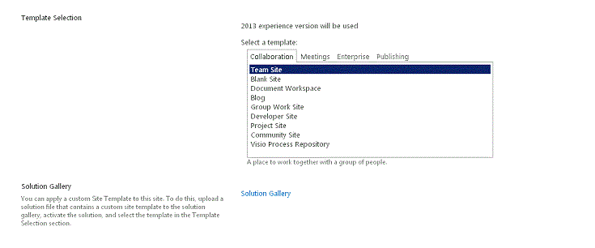

# Set up a general development environment for SharePoint 2013
Learn the steps to set up a SharePoint development environment by installing SharePoint and Visual Studio. 
 **Last modified:** May 15, 2016
  
    
    

 * **Applies to:** SharePoint Foundation 2013 | SharePoint Server 2013* 
## How to determine the SharePoint development environment you need
<a name="SP15_bk_determinedevenv"> </a>

First, decide what you want to build (to learn more about SharePoint Add-ins, see  [SharePoint Add-ins](http://msdn.microsoft.com/library/cd1eda9e-8e54-4223-93a9-a6ea0d18df70%28Office.15%29.aspx)): 
  
    
    

- If you want to build farm solutions, we provide those steps in this article. 
    
  
- If you want to create SharePoint Add-ins, see  [Tools and environments for developing SharePoint Add-ins](http://msdn.microsoft.com/library/6906eb86-8270-4098-8106-1e8d0d3c212e%28Office.15%29.aspx). 
    
  

## Create a SharePoint development environment on a Microsoft Azure virtual machine
<a name="SP15_bk_devenvazure"> </a>

If you have an MSDN subscription, you can quickly provision a virtual machine in Azure. 
  
    
    
If you haven't activated the Microsoft Azure benefit that comes with your MSDN subscription, you can learn more about it at  [Microsoft Azure Benefit for MSDN Subscribers](http://azure.microsoft.com/en-us/pricing/member-offers/msdn-benefits/). 
  
    
    

> [!Note]  
> The Microsoft Azure Image Gallery no longer provides images with SharePoint and Visual Studio preinstalled. But a Microsoft Azure VM is still a good option for a development machine. 
> Sign in to the  [Microsoft Azure management portal](https://manage.windowsazure.com). 
> Create a VM using one of the images in the gallery for Windows Server 2008 R2 Service Pack 1 x64, Windows Server 2012 (or later). Follow the instructions provided by the virtual machine creation wizard. We recommend an  **X-Large** VM size for SharePoint development.
> After the machine is provisioned and running, complete the setup using the same procedures in the section below  **Create a SharePoint development environment on premises**. (Skip the section about installing the operating system.)
> Once you've set up your development environment, you can access your source control from Visual Studio on the virtual machine by using an Azure Point-to-Site connection. See  [Configure a point-to-site VPN connection to an Azure Virtual Network](https://azure.microsoft.com/en-us/documentation/articles/vpn-gateway-point-to-site-create/) for instructions on how to do this.
  
    
    


## Create a SharePoint development environment on premises
<a name="SP15_bk_devenvazure"> </a>


  
    
    

### Install the operating system for your SharePoint Add-ins development environment
<a name="SP15_bk_InstallOS"> </a>

The requirements for a development environment for an installation of SharePoint are less stringent and costly than the requirements for a production environment. In any development environment, you should use a computer with an x64-capable CPU, and at least 16 GB of RAM to install and run SharePoint; 24 GB of RAM is preferable. Depending on your specific requirements and budget, you can choose one of the following options: 
  
    
    

- Install SharePoint on Windows Server 2008 R2 Service Pack 1 x64 or Windows Server 2012 (or later). 
    
  
- Use Microsoft Hyper-V and install SharePoint on a virtual machine running a Windows Server 2008 R2 Service Pack 1 x64 or Windows Server 2012 guest operating system. See  [Use best practice configurations for the SharePoint 2013 virtual machines and Hyper-V environment](http://technet.microsoft.com/en-US/library/ff621103%28v=office.15%29.aspx) for guidance on setting up a Microsoft Hyper-V virtual machine for SharePoint.
    
  

### Install the app development prerequisites for the operating system and SharePoint 2013
<a name="SP15_bk_prereqsOS"> </a>

SharePoint requires your operating system to have certain prerequisites installed before installation begins. For this reason, SharePoint includes a PrerequisiteInstaller.exe tool that installs all of the prerequisites for you. Run this tool before running the Setup.exe tool. 
  
    
    

1. Run the PrerequisiteInstaller.exe tool. 
    
  
2. Run the Setup.exe tool included with your installation files. 
    
  
3. Accept the Microsoft Software License Terms. 
    
  
4. On the  **Choose the installation you want** page, choose **Stand-alone**. 
    
    **Figure 2. Installation type choice**

  

     
  

  

  
5. If any errors occur in the installation, review the log file. To find the log file, open a Command Prompt window, and then type the following commands at the command prompt. A link to the log file also appears when the installation is complete. 
    
  ```
  
cd %temp
dir /od *.log
  ```

6. After the installation is complete, you are prompted to start the SharePoint Products and Technologies Configuration Wizard. 
    
    > [!Note]  
> The SharePoint Products and Technologies Configuration Wizard can fail if you are using a computer that is joined to a domain but that is not connected to a domain controller. If this failure occurs, connect to a domain controller either directly or through a Virtual Private Network (VPN) connection, or sign in with a local account that has administrative privileges on the computer. 
7. After the configuration wizard is complete, you see the  **Template Selection** page of the new SharePoint site.
    
    **Figure 3. Choose site template page**

  

     
  

  

  

### Install Visual Studio
<a name="SP15_bk_installVS"> </a>

When you install Visual Studio, you get all of the templates, tools, and assemblies to develop SharePoint on your local development machine. 
  
    
    
See  [Installing Visual Studio](http://msdn.microsoft.com/en-us/library/e2h7fzkw.aspx) for instructions about installing Visual Studio.
  
    
    

#### Verbose logging in Visual Studio

Follow these steps if you want to turn on verbose logging: 
  
    
    

1. Open the registry, and navigate to  **HKEY_CURRENT_USER\\Software\\Microsoft\\VisualStudio\\ _nn.n_\\SharePointTools**, where _nn.n_ is the version of Visual Studio, such as 12.0 or 14.0.
    
  
2. Add a DWORD key named  **EnableDiagnostics**.
    
  
3. Give the key the value  **1**.
    
  
The registry path will change in future versions of Visual Studio. 
  
    
    

## Next steps
<a name="SP15_bk_devenvazure"> </a>

If you will be creating workflows, continue with  [Set up and configure SharePoint 2013 Workflow Manager](set-up-and-configure-sharepoint-2013-workflow-manager.md). 
  
    
    

## Additional resources
<a name="SP15_bk_AddlResources"> </a>


-  [Installing Visual Studio](http://msdn.microsoft.com/en-us/library/e2h7fzkw%28v=vs.110%29.aspx)
    
  
-  [Tools and environments for developing SharePoint Add-ins](http://msdn.microsoft.com/library/6906eb86-8270-4098-8106-1e8d0d3c212e%28Office.15%29.aspx)
    
  

  
    
    

