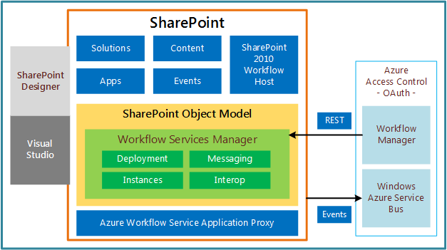

# What's new in workflows for SharePoint 2013
Learn about the capabilities and features that are new to workflows in SharePoint 2013. 
The workflow framework in SharePoint 2013 is significantly changed from previous versions. The following sections provide brief summaries of the most significant updates and enhancements to the workflow infrastructure. 
  
    
    

## Completely redesigned workflow infrastructure

SharePoint 2013 workflows are powered by Windows Workflow Foundation 4 (WF), which was substantially redesigned from previous versions. Windows Workflow Foundation, in turn, is built on the messaging functionality that is provided by  [Windows Communication Foundation (WCF)](http://msdn.microsoft.com/en-us/netframework/aa663324). 
  
    
    
Perhaps the most prominent feature of the new workflow infrastructure is the introduction of Microsoft Azure as the new workflow execution host. The workflow execution engine now lives outside of SharePoint, in Microsoft Azure. Figure 1 provides a generalized, high-level view of the new workflow infrastructure. For a more thorough discussion of the concepts presented in Figure 1, see  [SharePoint 2013 workflow fundamentals](sharepoint-2013-workflow-fundamentals.md). 
  
    
    

**Figure 1. High-level architecture of the workflow infrastructure**

  
    
    

  
    
    

  
    
    

  
    
    

  
    
    

## Fully declarative, no-code authoring environment

Another of the prominent changes is that workflows on the WF 4 platform are fully declarative. That is, workflows are no longer compiled into managed assemblies and deployed to an assembly cache. Instead, XAML files define your workflows and frame their execution. 
  
    
    

## Enhanced SharePoint Designer 2013 authoring support

SharePoint Designer 2013 has been updated with the goal of making it the authoring environment of choice for authoring SharePoint workflows. SharePoint Designer 2013 provides workflow authors with both a designer surface and a text-based workflow authoring environment. Additionally, you can develop workflow custom actions in Visual Studio 2012 and then import them into SharePoint Designer 2013, where they can then be accessed from the Workflow Designer. 
  
    
    
In short, the needs of both the information worker (the "power user") and the developer have been harnessed in SharePoint workflow authoring and development environments. 
  
    
    

## Visual Studio 2012 workflow project type support

To make collaboration easier between information worker and software developer, Visual Studio 2012 provides SharePoint workflow project types and a workflow custom action-item type. For more information about developing workflows by using Visual Studio 2012, and for information about differentiating between SharePoint Designer 2013 and Visual Studio 2012 in workflow development, see  [Develop SharePoint 2013 workflows using Visual Studio](develop-sharepoint-2013-workflows-using-visual-studio.md). 
  
    
    

## Support for creating custom actions

A lot of effort has gone into anticipating the business requirements of workflow authors in the providing of workflow templates, actions, and activities in SharePoint Designer 2013 and in Visual Studio 2012. However, we also know that we cannot anticipate each person's specific needs. For this reason, Visual Studio 2012 provides a workflow custom action-item type that lets developers create custom actions. For more information about workflow custom actions, see  [How to: Build and deploy workflow custom actions](how-to-build-and-deploy-workflow-custom-actions.md). 
  
    
    

## Tools support for SharePoint workflows

Visual Studio 2012 provides templates and support for creating workflows on the SharePoint 2013 workflow framework. SharePoint 2013 workflows are similar to previous versions of workflows except that they are powered by WF 4 and run in Microsoft Azure. They are also declarative-only (XAML) and designed to interact with the cloud and work with SharePoint Add-ins. One of their primary benefits is that they enable you to remotely host and run workflows outside SharePoint Server. 
  
    
    

## New workflow actions

Following are new workflow actions that are provided in SharePoint 2013. For a full detailing of both new and deprecated actions, see  [Workflow actions and activities reference for SharePoint 2013](workflow-actions-and-activities-reference-for-sharepoint-2013.md). New to workflows in SharePoint 2013 are a set of workflow actions that allow you to integrate with Project 2013 and let you create Project-based workflows. 
  
    
    

**Table 1. New workflow actions in SharePoint 2013**

|**Action**|**Description**|
|:-----|:-----|
|Assign a Task |Assigns a single workflow task to a user or group. |
|Start a Task Process |Initiates execution of a task process. |
|Go to This Stage |Specifies the next stage in a workflow to which flow control should be handed. |
|Call HTTP Web Service |Functions as a method call to a Representational State Transfer (REST) endpoint. |
|Start a List Workflow |Starts a list-scoped workflow. |
|Start a Site Workflow |Starts a site-scoped workflow. |
|Build DynamicValue |Creates a new variable of type **DynamicValue**. |
|Get Property from DynamicValue |Retrieves a property value from a specified variable of type **DynamicValue**. |
|Count Items in DynamicValue |Returns the number of rows in a variable of type **DynamicValue**. |
|Trim String |Removes all leading and trailing white-space characters from the current string. |
|Find Substring in String |Returns 1-based index of the first occurrence of one or more characters, or the first occurrence of a string, within a string. |
|Replace Substring in String |Returns a new string in which all occurrences of a specified character or string are replaced with another specified character or string. |
|Translate Document |Functions as a wrapper around the HTTP activity that calls the synchronous translation API. You must configure a Machine Translation Service Application for the SharePoint site on which you run the workflow. |
|Set Workflow Status |Updates workflow status as specified in message string. |
|Create a Project from Current Item [Microsoft Project] |Creates a Project Server project based on the current item. |
|Set the current project stage status to this value [Microsoft Project] |Sets the two status fields within the current stage of the project. |
|Set the status field in the idea list item to this value [Microsoft Project] |Updates the status field of the original SharePoint list item. |
|Wait for Project Event [Microsoft Project] |Pauses the current instance of the workflow to await a specified Project event: Project checked in, Project committed, Project submitted. |
|Set this field in the project to this value [Microsoft Project] |Sets the value for the enterprise custom field for a specified project. |
   

## Additional resources

-  [Get started with workflows in SharePoint 2013](get-started-with-workflows-in-sharepoint-2013.md)
    
  
-  [What's new for developers in SharePoint 2013](what’s-new-for-developers-in-sharepoint-2013.md)
    
  
-  [Workflow actions and activities reference for SharePoint 2013](workflow-actions-and-activities-reference-for-sharepoint-2013.md)
    
  
-  [Workflow actions quick reference (SharePoint 2013 Workflow platform)](workflow-actions-quick-reference-sharepoint-2013-workflow-platform.md)
    
  

